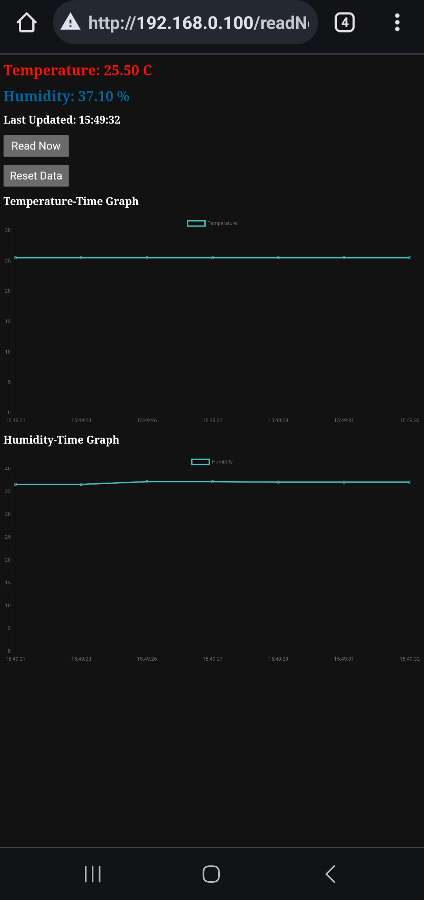
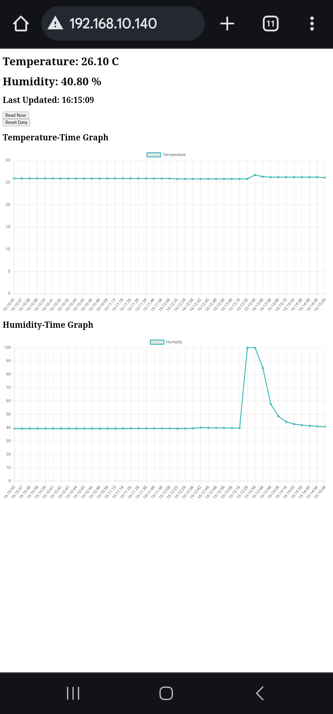

# Temperature and Humidity Monitor with NTP and Charts

<p align="center">
  
  
</p>

## Overview
This project is a temperature and humidity monitoring system that uses the **AM2302 sensor** to gather data and serves it via a **local webpage**. The system logs data and displays interactive charts for analysis over a local network. It also uses **NTP (Network Time Protocol)** for real-time tracking and synchronization.

## Features
- **WiFi Connectivity**: Connects to a local WiFi network.
- **Real-time Data**: Reads temperature and humidity data every 10 minutes from the AM2302 sensor.
- **Webpage with Live Charts**: Serves a webpage with live temperature and humidity charts using **Chart.js**.
- **Manual Data Retrieval**: Allows manual refresh of temperature and humidity data via the webpage.
- **NTP Synchronization**: Tracks real-time using NTP, manually adjustable for daylight saving time (DST).

## Hardware Requirements
- **Arduino MKR WiFi 1010**
- **AM2302 (DHT22) Temperature and Humidity Sensor**
- **10KΩ Resistor**

## Libraries Used
- **WiFiNINA**: For handling WiFi connection.
- **DHT**: For reading temperature and humidity data from the AM2302 sensor.
- **NTPClient**: For synchronizing time using NTP.
- **WiFiUdp**: For handling UDP requests used with NTPClient.
- **ArduinoJson**: For creating and parsing JSON data in web responses.

## Project Setup

<p align="center">
  
</p>

### Wiring
- Connect the **AM2302 sensor** to the Arduino MKR WiFi 1010:
  - **VCC** → 3.3V
  - **GND** → GND
  - **Data** → Pin 2 (via a 10KΩ pull-up resistor)

### Software Setup
1. Install the necessary Arduino libraries:
   - WiFiNINA
   - DHT sensor library
   - NTPClient
   - ArduinoJson
2. Configure WiFi credentials in the sketch:
   ```cpp
   char ssid[] = "YOUR_SSID";    // Your WiFi network name
   char pass[] = "YOUR_PASSWORD"; // Your WiFi password
   ```
3. Upload the program to your **Arduino MKR WiFi 1010**.

## Usage
1. **Connect to WiFi**: Upon powering the Arduino, it will attempt to connect to the configured WiFi network.
2. **Access the Webpage**:
   - Once connected, the local IP address will be printed in the **Serial Monitor**. Use this IP address to access the local webpage through any web browser on the same network.
   - The webpage will display the current temperature and humidity values and will show live updating charts based on the logged data.
3. **Manual Data Retrieval**:
   - Click the "Read Now" button on the webpage to manually trigger a sensor reading and refresh the data.
4. **Reset Data**:
   - Use the "Reset Data" button to clear all logged temperature and humidity history.
  
## Future Improvements
- **Automatic Daylight Saving Time (DST)** adjustment.
- **Static IP Assignment**: Automatically assign a static IP to the device without changing router settings.

## Webpage Features
- **Real-time data display**: Shows the current temperature and humidity.
- **Interactive charts**: Displays temperature and humidity over time using **Chart.js**.
- **Buttons**: Allows for manual sensor reading and data reset through the webpage interface.

---

## License
This project is released under the MIT License.